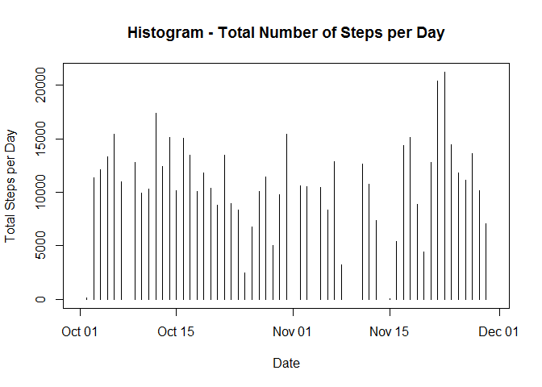
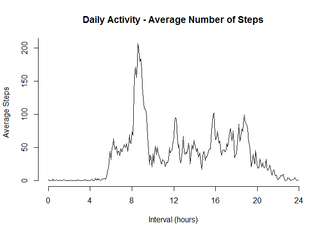
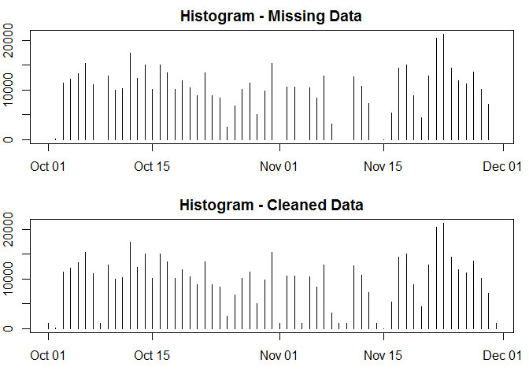
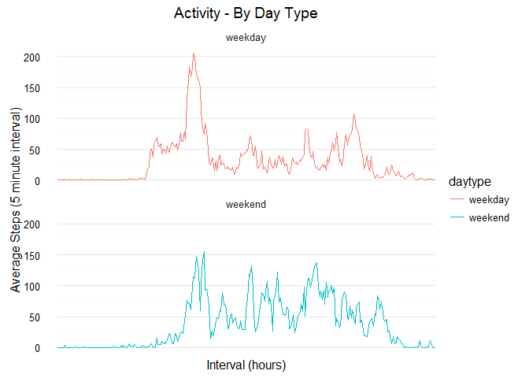

# Reproducible Research: Peer Assessment 1


## Loading and preprocessing the data

1. Load the data.  
2. Process/transform the data into a format suitable for analysis.  


```r
suppressPackageStartupMessages(library(dplyr))
```

```
## Warning: package 'dplyr' was built under R version 3.2.4
```

```r
suppressPackageStartupMessages(library(ggplot2))
```

```
## Warning: package 'ggplot2' was built under R version 3.2.5
```

```r
data <- read.csv("C:/Users/Chris/Google Drive/R/activity.csv", 
                 stringsAsFactors=FALSE)
data$date <- as.Date(data$date)
summary(data)
```

```
##      steps             date               interval     
##  Min.   :  0.00   Min.   :2012-10-01   Min.   :   0.0  
##  1st Qu.:  0.00   1st Qu.:2012-10-16   1st Qu.: 588.8  
##  Median :  0.00   Median :2012-10-31   Median :1177.5  
##  Mean   : 37.38   Mean   :2012-10-31   Mean   :1177.5  
##  3rd Qu.: 12.00   3rd Qu.:2012-11-15   3rd Qu.:1766.2  
##  Max.   :806.00   Max.   :2012-11-30   Max.   :2355.0  
##  NA's   :2304
```


## What is mean total number of steps taken per day?

Ignore missing values in the dataset.  
1. Calculate the total number of steps taken per day.  
2. Make a histogram of the total number of steps taken each day.  
3. Calculate and report the mean and median of the total number of steps taken 
per day.  


```r
days <- group_by(data, date)
days <- summarise(days, nintervals=n(), avgsteps=mean(steps,na.rm=TRUE), totsteps=nintervals*avgsteps)
plot(days$date, days$totsteps, type="h",xlab="Date",ylab="Total Steps per Day",
     main="Histogram - Total Number of Steps per Day")
```

<!-- -->

__Total Number of Steps Taken Each Day:__  

   Mean   |   Median  
--------- | -----------  
10766.19 | 10765  


## What is the average daily activity pattern?

1. Make a time series plot of the 5-minute interval and the average number of 
steps taken, averaged across all days.
2. Which 5-minute interval, on average across all the days in the dataset 
contains the maximum number of steps?

```r
intervals <- group_by(data, interval)
intervals <- summarise(intervals, avgsteps=mean(steps,na.rm=TRUE), medsteps=median(steps,na.rm=TRUE))
intervals <- mutate(intervals, minutes=as.integer(interval/100), 
                    seconds=(interval - 100*minutes), index=60*minutes 
                    + seconds)
plot(intervals$index/60, intervals$avgsteps, type="l", 
     xlab="Interval (hours)", ylab="Average Steps", 
     main="Daily Activity - Average Number of Steps", axes=FALSE)
axis(side=1, at=seq(0, 24, by=4))
axis(side=2, at=seq(0, 250, by=50))
```

<!-- -->

```r
intervals <- filter(intervals, !is.na(avgsteps))
maxsteps <- summarise(intervals, maxsteps=max(avgsteps))
maxinterval <- filter(intervals, avgsteps == maxsteps$maxsteps)
```

__5-minute Interval Containing the Maximum Number of Steps__  

```
## Source: local data frame [1 x 6]
## 
##   interval avgsteps medsteps minutes seconds index
##      (int)    (dbl)    (int)   (int)   (dbl) (dbl)
## 1      835 206.1698       19       8      35   515
```


## Imputing missing values

1. Calculate and report the total number of missing values in the dataset.  
2. Devise a strategy for filling in all of the missing values in the dataset.  
3. Create a new dataset with the missing data filled in.  
4. Make a histogram of the total number of steps taken each day.  Calculate and 
report the __mean__ and the __median__ total number of steps taken each day.  

__Total Number of NA's:__ 2304


```r
summary(data)
```

```
##      steps             date               interval     
##  Min.   :  0.00   Min.   :2012-10-01   Min.   :   0.0  
##  1st Qu.:  0.00   1st Qu.:2012-10-16   1st Qu.: 588.8  
##  Median :  0.00   Median :2012-10-31   Median :1177.5  
##  Mean   : 37.38   Mean   :2012-10-31   Mean   :1177.5  
##  3rd Qu.: 12.00   3rd Qu.:2012-11-15   3rd Qu.:1766.2  
##  Max.   :806.00   Max.   :2012-11-30   Max.   :2355.0  
##  NA's   :2304
```

__Strategy:__
Replace the NA's in the dataset with the __median__ number of steps in each 
5-minute interval for the days with no NA's in that interval.  


```r
na <- filter(data, is.na(steps))
notna <- filter(data, !is.na(steps))
newdf <- inner_join(na, intervals, by="interval")
newdf <- select(newdf, steps=medsteps, date, interval)
newdata <- bind_rows(newdf, notna)
newdata <- arrange(newdata, date, interval)
summary(newdata)
```

```
##      steps          date               interval     
##  Min.   :  0   Min.   :2012-10-01   Min.   :   0.0  
##  1st Qu.:  0   1st Qu.:2012-10-16   1st Qu.: 588.8  
##  Median :  0   Median :2012-10-31   Median :1177.5  
##  Mean   : 33   Mean   :2012-10-31   Mean   :1177.5  
##  3rd Qu.:  8   3rd Qu.:2012-11-15   3rd Qu.:1766.2  
##  Max.   :806   Max.   :2012-11-30   Max.   :2355.0
```


```r
newdays <- group_by(newdata, date)
newdays <- summarise(newdays, nintervals=n(), avgsteps=mean(steps,na.rm=TRUE), totsteps=nintervals*avgsteps)
par(mfrow=c(2,1),mar=c(3,2,2,1))
plot(days$date, days$totsteps, type="h",xlab="Date",ylab="Total Steps per Day",
     main="Histogram - Missing Data")
plot(newdays$date, newdays$totsteps, type="h",xlab="Date",
     ylab="Total Steps per Day",main="Histogram - Cleaned Data")
```

<!-- -->

__Total Number of Steps Taken Each Day:__  

Missing Data |   Mean   |   Median  
------------ | --------- | -----------  
Yes | 10766.19 | 10765  
No | 9503.87 | 10395

5. Do these values differ from the estimates from the first part of the 
assignment? What is the impact of imputing missing data on the estimates of the 
total daily number of steps?  

__Answer:__ The mean is much more sensitive to the effects of the missing data.  
The median is also affected, but not as much by imputing values for the missing 
data.  Since these data are highly _skewed_, the median is a better measure of 
the location of the data.  


## Are there differences in activity patterns between weekdays and weekends?

1. Create a new _factor_ variable in the dataset, with two levels - "weekday" 
and "weekend," indicating whether a given date is a weekday or weekend day.  
2. Make a panel plot containing a time series plot of the 5-minute interval and 
the average number of steps taken, averaged across all weekday days or weekend days.  


```r
newdata$daytype <- factor(sapply(newdata$date, 
                                 function(d) { if (weekdays(d) %in% 
                                                   c("Saturday","Sunday")) "weekend" 
                                     else "weekday" }))
intervals <- group_by(newdata, interval, daytype)
intervals <- summarise(intervals, avgsteps=mean(steps))
intervals <- mutate(intervals, minutes=as.integer(interval/100), 
                    seconds=(interval - 100*minutes), index=60*minutes + seconds)
ggplot(intervals, aes(x=index/60,y=avgsteps)) + geom_line(aes(color=daytype)) + scale_x_discrete(breaks=seq(0,24,by=4)) + xlab("Interval (hours)") + ylab("Average Steps (5 minute interval)") + ggtitle("Activity - By Day Type") + facet_wrap(~daytype,nrow=2) + theme_minimal()
```

<!-- -->
